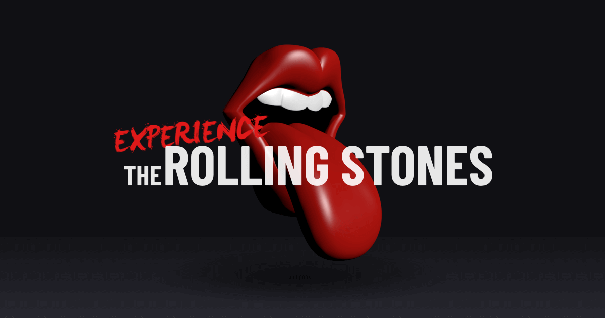
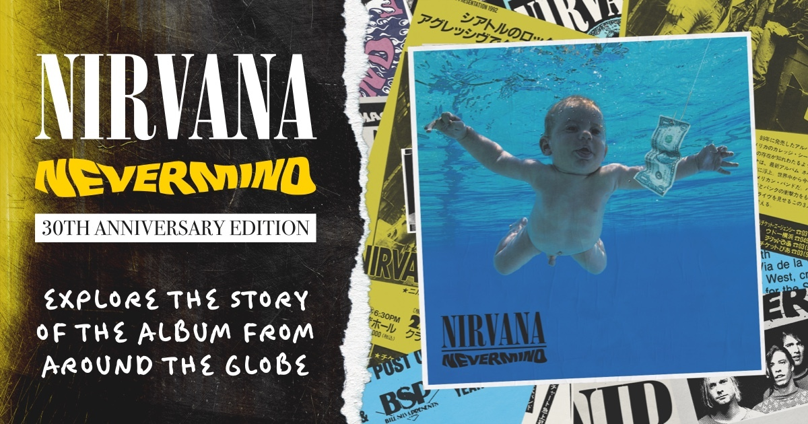
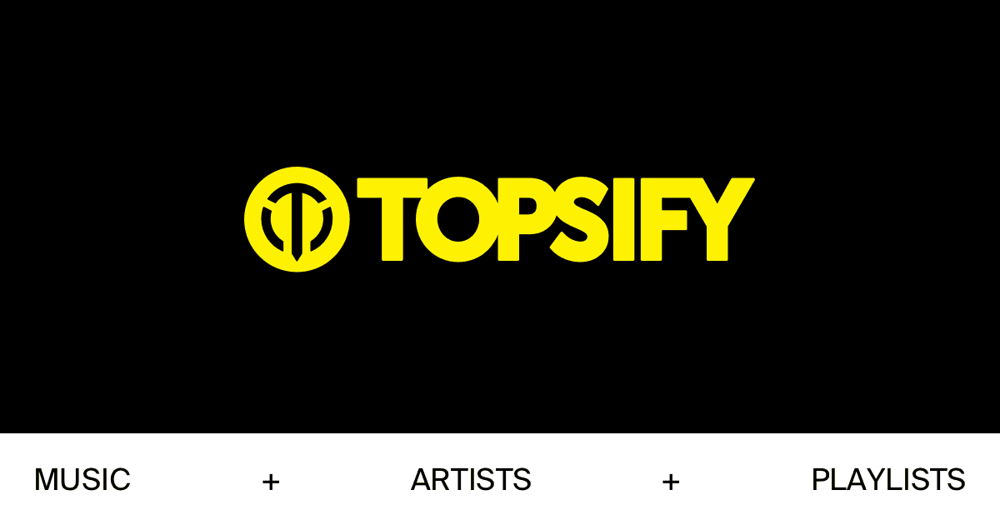

  

<h1>About Me</h1>

I am currently building experiences for recording artists, labels and everything in between @ Modern English. I am a lover of all thigs JavaScript, but love to get my hands dirty with whatever tech stack helps me solve a problem.

<h1>Recent Projects</h1>

<h3>The Rolling Stones Experience</h3>

Hyrbid Wordpress & Vue development celebrating the career of The Rolling Stones

<a href="https://experience.rollingstones.com/" target="_blank" rel="noopener noreferrer">View Live</a>
  

  

<h3>Nirvana</h3>

Vue with ThreeJS project sharing Nirvana fan stories from all around the world

<a href="https://nevermind.nirvana.com/" target="_blank" rel="noopener noreferrer">View Live</a>
  

  

<h3>Topsify</h3>

Custom CMS development with Laravel, Livewire and Tailwind

<a href="https://topsify.com/" target="_blank" rel="noopener noreferrer">View Live</a>
  

  

<!--
**SimonMckeon/SimonMckeon** is a ✨ _special_ ✨ repository because its `README.md` (this file) appears on your GitHub profile.

Here are some ideas to get you started:

- 🔭 I’m currently working on ...
- 🌱 I’m currently learning ...
- 👯 I’m looking to collaborate on ...
- 🤔 I’m looking for help with ...
- 💬 Ask me about ...
- 📫 How to reach me: ...
- 😄 Pronouns: ...
- ⚡ Fun fact: ...
  -->
